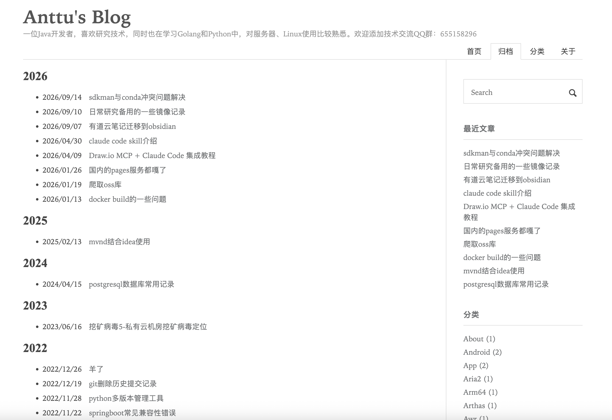

# Maupassant

Maupassant theme, ported to Hugo.

1. Preview: [Anttu's Blog](https://anTtutu.github.io)
2. [中文文档](README.md)

A clean, fast Hugo theme that adapts to different devices (PC, mobile, etc.). It is originally based on the Typecho theme [Maupassant](https://github.com/pagecho/maupassant/) by Cho, forked from [JokerQyou](https://github.com/JokerQyou/maupassant-hugo), with many features added and modified, such as Google Analytics, recent posts, tag cloud, custom menus, and date-based archives.

> Acknowledgements: this theme is a further fork and optimization based on the [maupassant-hugo](https://github.com/flysnow-org/maupassant-hugo) revision by [飞雪无情 (flysnow.org)](https://www.flysnow.org/), adapted for personal needs and newer Hugo versions. Many thanks to all the original authors for their open-source spirit.

## Preview



## Features

1. Local Search (built-in site search)
2. Recent posts (latest 10 posts)
3. Categories with post counts
4. Tag cloud
5. Table of contents for posts
6. Back-to-top button
7. SEO-friendly keyword support
8. Custom menus with unlimited entries and ordering
9. Custom friend links
10. Archives grouped by year and date
11. Google Analytics support
12. Busuanzi page view counter
13. Code highlighting, line numbers, and copy button
14. Sitemap
15. RSS support with auto-discovery
16. Google site search
17. "See Also" related posts
18. Disqus comments
19. Custom CSS & JS
20. Utterances and [Waline](https://waline.js.org) comments
21. Extra custom shortcodes
22. Custom post summary
23. Custom ad slots
24. Custom ICP (filing) information
25. Custom image CDN
26. Click-to-zoom images
27. asciinema player for terminal recordings
28. Flowcharts, sequence diagrams, and other common Markdown diagrams

## Installation

```bash
cd <YOUR_BLOG_ROOT_DIR>
git clone https://github.com/anTtutu/maupassant-hugo themes/maupassant
```

## Configuration

#### Requirements

Hugo Version >= 0.60.0

#### Apply the theme

```toml
theme = "maupassant"
```

#### Quick start

There is a `config.toml` file in the theme's [exampleSite](exampleSite/) directory. Copy it to your site root directory and modify it according to your needs.

#### Code highlighting

Since Hugo v0.60.0, Markdown files are rendered by `Goldmark` with code highlighting enabled by default, so the theme's original JS-based highlighter was incompatible. The theme now uses Hugo's native code highlighting.

The built-in highlighting works out of the box with no configuration. To enable line numbers or change the style, refer to the following:

*config.toml*
```toml
[markup]
  [markup.highlight]
    lineNos = true
    style = "github"
```

For more options and styles, see:

[Configure Markup](https://gohugo.io/getting-started/configuration-markup/)
[Syntax Highlighting](https://gohugo.io/content-management/syntax-highlighting/)

#### Custom menus

```toml
# Menus
[menu]
  [[menu.main]]
    identifier = "archives"
    name = "Archives"
    url = "/archives/"
    weight = 2

  [[menu.main]]
    identifier = "tags"
    name = "Tags"
    url = "/tags/"
    weight = 3

  [[menu.main]]
    identifier = "about"
    name = "About"
    url = "/about/"
    weight = 4
```

The `identifier` must be unique; `weight` controls the order — the smaller the value, the closer to the front.

#### Table of contents (outline)

The theme generates a TOC automatically from `h1~h7` headings (i.e. `##` markers in Markdown). Two levels at most, starting from `h2`, are recommended for SEO.

To enable the TOC for a post, add `toc=true` to its Front Matter. It is disabled by default.

```toml
toc = true
```

A floating TOC is shown when the empty space on the left is wider than 100px.

#### Local Search

Site search is disabled by default. To enable it:

1. Check the `disableKinds` option in `config.toml` — RSS must not be disabled.
2. Add `localSearch = true` to the `[params]` section of `config.toml`.
3. Create a `search` directory under `content`, then create `search/index.md` with the following content:

```
---
title: "Search"
description: "Search page"
type: "search"
---
```

Run `hugo server`, open your site, and type keywords in the search box at the top right corner.

#### Friend links

```toml
[[params.links]]
  title = "Hugo Documentation"
  name = "Hugo Documentation"
  url = "https://gohugo.io/documentation/"
[[params.links]]
  title = "The Go Programming Language"
  name = "The Go Programming Language"
  url = "https://go.dev/"
```

`params.links` is an array, so you can define as many links as you like. `name` is the displayed link text; `title` is the tooltip shown on hover.

#### Ads module

The ads module sits in the sidebar and is flexible enough for text or image ads.

```toml
[[params.ads]]
  title = "Aliyun coupon"
  url = "https://www.aliyun.com/"

[[params.ads]]
  title = "Aliyun coupon"
  url = "https://www.aliyun.com/activity"
  img = "https://img.alicdn.com/tfs/TB17qJhXpzqK1RjSZFvXXcB7VXa-200-126.jpg"
[[params.ads]]
  title = "Aliyun coupon"
  url = "https://www.aliyun.com/daily-act"
  img = "https://img.alicdn.com/tfs/TB1aDXhXpzqK1RjSZFvXXcB7VXa-259-194.jpg"
```

`params.ads` is an array, so you can define as many ads as you like. If `img` is present, the image ad takes priority; `title` is the tooltip shown on hover.

See it in action at [https://anTtutu.github.io/](https://anTtutu.github.io/)

#### Google Analytics

The theme supports Google Analytics. Just add the following to `config.toml`:

```toml
googleAnalytics = "GA ID"
```

#### Archives

Hugo does not generate archive pages by default. This theme implements them — create `content/archives/index.md` with:

```md
title: "Archives"
description: Your personal description, shown on the archives page
type: archives
```

`title` and `description` can be your own, but `type` must be `archives`.

#### ICP filing information

For sites hosted in China, add the filing info in the `[params]` section of `config.toml`:

```toml
[params]
  beian = "粤ICP备XXXXXXX号-1"
```

Replace it with your own filing number.

#### Click-to-zoom images

This loads jQuery and Fancybox CSS/JS:

```toml
[params]
  fancybox = true
```

#### Image CDN

The configured host is prefixed to image `src` paths referenced in Markdown. Paths with an `http` prefix are left untouched.

Note: do not add a trailing `/` to the host.
> You can use jsDelivr with your GitHub repository for acceleration.

```toml
[params.image_cdn]
    enable = true
    Host = "https://cdn.jsdelivr.net/gh/user/user.github.io"
```

#### JS CDN

For users in China, switching to `cdn.bootcdn.net` is recommended:

```toml
[params]
  cdnJsSite = "cdn.bootcdn.net" # default: cdnjs.cloudflare.com
```

#### Disqus

To enable Disqus comments, add the following to `config.toml`:

```toml
disqusShortname = "yourdiscussshortname"
```

Replace it with your own Disqus short name.

#### Custom post summary

The theme uses Hugo's built-in summary support. You can define your summary with `<!--more-->`, or use the automatic summary and configure its length in `config.toml`:

```toml
# default is 70
summaryLength = 140
```

#### Copyright notice

To enable a copyright notice, add the following to `config.toml`:

```toml
[params.cc]
    name = "Attribution-NonCommercial-NoDerivatives 4.0 International"
    link = "https://creativecommons.org/licenses/by-nc-nd/4.0/"
```

Replace `name` and `link` with the license you use.

#### Utterances

The theme supports [Utterances](https://utteranc.es), a comment system based on GitHub Issues — easy to use and no proxy needed. Add the following to `config.toml`:

```toml
[params.utteranc]
    enable = true
    repo = ""    # the repo that stores the comments, in owner/repo format
    issueTerm = "pathname"  # how GitHub issues are mapped to your posts
    theme = "github-light" # theme: github-light or github-dark
```

Available `issueTerm` options:
1. `pathname` — by path, recommended. Comments survive domain changes.
2. `url` — by full URL.
3. `title` — by page title.

There are a few other rarely used options not covered here.

#### Waline comment system

[Waline](https://waline.js.org/) is a comment system with a backend, derived from Valine — fast, secure, free to deploy, with notification support.

Set `enable` to `true` to activate it. Get `serverURL` from the official deployment guide.

```toml
[params.waline]
    enable = false
    placeholder = "Say something..."
    serverURL = "Your waline serverURL" # replace with your serverURL
```

#### Busuanzi page view counter

The theme supports Busuanzi, a minimal page view counter. To enable it, add the following to `config.toml`:

```toml
[params]
  busuanzi = true
```

#### About the category name lowercasing issue

Before Hugo `0.55`, category names were lowercased. Hugo offered the `preserveTaxonomyNames` config to keep the original names. In Hugo `0.55`, [preserveTaxonomyNames was removed](https://gohugo.io/content-management/taxonomies/#example-removing-default-taxonomies); this theme now reads and displays the original strings of tags and categories by default, so the casing issue is elegantly resolved.

#### Disable URL path lowercasing

By default, letters in URL strings are lowercased. If your category or tag names contain uppercase letters, links break after migrating your blog (e.g. from Hexo to Hugo). Hugo's `disablePathToLower` config solves this:

```toml
## Disable lowercasing URL paths
disablePathToLower = true
```

#### Custom CSS & JS

```
[params]
  # files below are stored in the theme's static folder; the site root also works
  customCSS = ['douban.css', 'other.css']
  # if ['custom.css'], loads '/static/css/custom.css'
  customJS = ['douban.js']
  # if ['custom.js'], loads '/static/js/custom.js'
```

#### Extra custom shortcodes

* Octopress blockquote (blockquote.html)
* Wikipedia Link Generator (wp.html)

```

```

* youku (youku.html)

#### Diagrams

- Sequence diagrams ([js-sequence](https://bramp.github.io/js-sequence-diagrams/))
  1. Enable globally in `config.toml`:

     ```toml
     [params.sequenceDiagrams]
         enable = true
         options = ""            # default: "{theme: 'simple'}"
     ```

  2. Or per-post in the Front Matter:

     ```yaml
     sequenceDiagrams:
       enable: true
     ```

  Set the code block language identifier to `sequence`. For example:

  ```
  ```sequence
  Alice->Bob: Hello Bob, how are you?
  Note right of Bob: Bob thinks
  Bob-->Alice: I am good thanks!
  ```
  ```

- Flowcharts ([flowchart.js](http://flowchart.js.org/))
  1. Enable globally in `config.toml`:

     ```toml
     [params.flowchartDiagrams]
       enable = true
       options = ""
     ```

  2. Or per-post in the Front Matter:

     ```yaml
     flowchartDiagrams:
       enable: true
     ```

  Set the code block language identifier to `flowchat` or `flow`. For example:

  ```
  ```flow
  st=>start: Start
  op=>operation: Your Operation
  cond=>condition: Yes or No?
  e=>end

  st->op->cond
  cond(yes)->e
  cond(no)->op
  ```
  ```

- Graphviz ([viz.js](https://github.com/mdaines/viz.js))

  Enable it per-post in the Front Matter:

  ```yaml
  graphviz:
    enable: true
  ```

  Set the code block language identifier to `viz-<engine>`, where engine is one of the Graphviz layout engines: `circo`, `dot`, `fdp`, `neato`, `osage`, or `twopi`. For example:

  ```
  ```viz-dot
  digraph G {

    subgraph cluster_0 {
        style=filled;
        color=lightgrey;
        node [style=filled,color=white];
        a0 -> a1 -> a2 -> a3;
        label = "process #1";
    }

    subgraph cluster_1 {
        node [style=filled];
        b0 -> b1 -> b2 -> b3;
        label = "process #2";
        color=blue
    }
    start -> a0;
    start -> b0;
    a1 -> b3;
    b2 -> a3;
    a3 -> a0;
    a3 -> end;
    b3 -> end;

    start [shape=Mdiamond];
    end [shape=Msquare];
  }
  ```
  ```

#### Hide a post from the home page

Set `hiddenFromHomePage` to `true` in the Front Matter.

*Defaults to `false`*

```toml
+++
title = '{{ replace .Name "-" " " | title }}'
tags = []
categories = []
date = "{{ .Date }}"
toc = true
draft = true
hiddenFromHomePage = false
+++
```

## Contributing

All kinds of contributions (enhancements, new features, documentation & code improvements, issues & bug reports) are welcome.

Looking forward to your pull request.

## Maupassant on other platforms

+ Typecho: https://github.com/pagecho/maupassant/
+ Octopress: https://github.com/pagecho/mewpassant/
+ Farbox: https://github.com/pagecho/Maupassant-farbox/
+ Wordpress: https://github.com/iMuFeng/maupassant/
+ Ghost: https://github.com/LjxPrime/maupassant/
+ Hexo: https://github.com/tufu9441/maupassant-hexo
+ Hugo: https://github.com/anTtutu/maupassant-hugo
